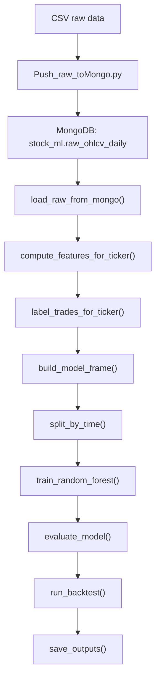

# Project Flow Explained

File này mô tả luồng của project hiện tại từ raw data cho tới output cuối cùng.
Mục tiêu là giúp bạn nhìn project như một pipeline hoàn chỉnh thay vì nhìn từng
hàm rời rạc.

## 1. Bức tranh tổng thể



Project hiện tại có thể chia thành 3 tầng:

1. `Data layer`
2. `Research / feature / label layer`
3. `Model + backtest + report layer`

## 2. Tầng dữ liệu: CSV -> Mongo

### File liên quan

- [Push_raw_toMongo.py](/C:/Users/doank/OneDrive/Documents/dev/ML_prj/Push_raw_toMongo.py)

### Luồng hoạt động

1. Script đọc từng file CSV trong `Data_Stock`
2. Chuẩn hóa tên cột
3. Đổi `time` thành `trading_date`
4. Gắn thêm:
   - `ticker`
   - `timeframe = "1D"`
   - `source = "vnstock"`
5. Upsert vào MongoDB collection `stock_ml.raw_ohlcv_daily`

### Điểm quan trọng

File này tạo index unique theo:

- `ticker`
- `trading_date`
- `timeframe`

Nghĩa là:

- cùng một mã,
- cùng một ngày,
- cùng một timeframe

thì chỉ có một bản ghi duy nhất.

Điều này giúp bạn có thể chạy push lại nhiều lần mà không sinh dữ liệu trùng.

## 3. Hàm lấy dữ liệu từ Mongo hoạt động như thế nào

### Hàm liên quan

- [training_RF_demo_core_.py](/C:/Users/doank/OneDrive/Documents/dev/ML_prj/Trainning_model/training_RF_demo_core_.py)
  trong hàm `load_raw_from_mongo()`

### Mục tiêu của hàm

Hàm này nhận dữ liệu từ Mongo và trả ra một `DataFrame` sạch để phần còn lại của
pipeline có thể dùng ngay.

### Luồng chi tiết

#### Bước 1: kiểm tra `mongo_uri`

Nếu không có `mongo_uri`, hàm dừng ngay. Điều này hợp lý vì không thể tạo
kết nối tới Mongo nếu không có URI.

#### Bước 2: tạo client Mongo

Hàm dùng:

- `MongoClient(...)`
- `tls=True`
- `tlsCAFile=certifi.where()`

Mục đích là tạo kết nối an toàn qua TLS.

#### Bước 3: chọn database và collection

Hàm lấy:

- database mặc định: `stock_ml`
- collection mặc định: `raw_ohlcv_daily`

#### Bước 4: dựng `query`

Query cơ bản luôn có:

```python
{"timeframe": timeframe}
```

Nếu người dùng truyền danh sách ticker, query sẽ thêm:

```python
{"ticker": {"$in": tickers}}
```

Nghĩa là:

- luôn lọc theo timeframe
- có thể lọc thêm theo danh sách mã

#### Bước 5: dựng `projection`

Projection là danh sách cột cần lấy từ Mongo.

Hàm chỉ lấy các cột tối thiểu:

- `ticker`
- `trading_date`
- `timeframe`
- `open`
- `high`
- `low`
- `close`
- `volume`

và loại `_id`.

Lợi ích:

- DataFrame gọn hơn
- tránh mang theo trường không cần thiết

#### Bước 6: đọc dữ liệu bằng `find(...).sort(...)`

Hàm dùng:

```python
collection.find(query, projection=projection).sort([("ticker", 1), ("trading_date", 1)])
```

Ý nghĩa:

- Mongo trả về đúng những dòng thỏa điều kiện
- dữ liệu được sắp theo:
  - ticker tăng dần
  - trading_date tăng dần

Điều này rất quan trọng vì sau đó các rolling indicator phải chạy trên chuỗi giá
đúng thứ tự thời gian.

#### Bước 7: đổi sang `DataFrame`

Kết quả từ Mongo là list các document. Hàm chuyển chúng thành `pandas.DataFrame`
để xử lý tiếp.

#### Bước 8: kiểm tra schema

Hàm kiểm tra xem dữ liệu có thiếu cột bắt buộc nào không. Nếu thiếu, hàm báo lỗi
ngay.

Đây là bước tốt vì nó làm lỗi xuất hiện sớm và rõ ràng, thay vì để model hỏng ở
bước sau.

#### Bước 9: ép kiểu dữ liệu

Hàm ép:

- `trading_date` -> datetime
- `open`, `high`, `low`, `close`, `volume` -> numeric

Nếu gặp giá trị bẩn:

- ngày hỏng -> `NaT`
- số hỏng -> `NaN`

#### Bước 10: loại dòng lỗi

Hàm dùng `dropna` để bỏ các dòng thiếu dữ liệu cốt lõi.

Điều này giúp phần feature engineering phía sau tránh phải xử lý nhiều trường
hợp dữ liệu bẩn.

#### Bước 11: sort lại lần cuối và reset index

Cuối cùng hàm sort lại theo:

- `ticker`
- `trading_date`

và `reset_index(drop=True)`.

Kết quả là một bảng sạch, đúng thứ tự, sẵn sàng cho bước tính feature.

### Tóm tắt vai trò của `load_raw_from_mongo()`

Hàm này làm 4 việc rất quan trọng:

1. kết nối Mongo
2. query đúng dữ liệu cần dùng
3. làm sạch kiểu dữ liệu
4. trả về DataFrame chuẩn hóa cho toàn bộ pipeline

Nó chính là "cửa vào" của data layer.

## 4. Tầng feature engineering

### File liên quan

- [training_RF_demo_core_.py](/C:/Users/doank/OneDrive/Documents/dev/ML_prj/Trainning_model/training_RF_demo_core_.py)
  trong hàm `compute_features_for_ticker()`

### Triết lý của project

Feature **không** được tính trên bảng đã trộn nhiều ticker.

Thay vào đó:

1. tách từng ticker ra
2. tính feature riêng cho từng ticker
3. sau đó mới nối dọc lại

Việc này được thực hiện qua `apply_per_ticker()`.

### Vì sao phải làm vậy

Nếu ACB đang ở cuối bảng và FPT ở đầu bảng tiếp theo, mà bạn tính rolling MA
trên cả bảng chung, thì:

- MA của FPT có thể dùng nhầm dữ liệu cuối của ACB

Điều đó là sai hoàn toàn. Vì vậy project xử lý từng ticker độc lập rồi mới gộp.

### Nhóm feature được tạo

Hàm `compute_features_for_ticker()` tạo 5 nhóm feature:

1. trend
2. momentum
3. volume
4. volatility
5. candle shape

Chi tiết đầy đủ xem ở file:

- [model_terms_and_features_guide.Rmd](/C:/Users/doank/OneDrive/Documents/dev/ML_prj/Other/model_terms_and_features_guide.Rmd)

## 5. Tầng tạo label

### File liên quan

- [training_RF_demo_core_.py](/C:/Users/doank/OneDrive/Documents/dev/ML_prj/Trainning_model/training_RF_demo_core_.py)
  trong hàm `label_trades_for_ticker()`

### Logic của label hiện tại

Với mỗi ngày `signal_idx`:

1. signal xảy ra ở ngày `t`
2. entry ở `open(t+1)`
3. theo dõi tối đa `horizon` phiên
4. nếu chạm target trước -> thoát vì `target`
5. nếu chạm stop trước -> thoát vì `stop`
6. nếu không chạm gì -> thoát ở `close` phiên cuối vì `timeout`

### Label thực sự model đang học là gì

Model **không** học:

- "trade có hit target không"

Model đang học:

- "trade giả định đó có lợi nhuận ròng dương sau phí không"

Tức là:

```text
buy_label = 1 nếu net_return > 0
buy_label = 0 nếu net_return <= 0
```

Đây là điểm rất quan trọng để hiểu đúng project.

### Vai trò của `ambiguity_mode`

Với dữ liệu ngày, có trường hợp cùng một cây nến:

- `high` chạm target
- `low` chạm stop

nhưng ta không biết cái nào đến trước.

Project xử lý như sau:

- `conservative`: coi stop xảy ra trước
- `optimistic`: coi target xảy ra trước

Hiện tại project dùng `conservative`.

## 6. Tầng gộp bảng để train

### Hàm liên quan

- `build_model_frame()`

### Bước làm việc

1. tính feature theo từng ticker
2. tạo label theo từng ticker
3. thay `inf/-inf` bằng `NaN`
4. nếu `candidate_mode = crossover_only` thì chỉ giữ `golden_cross == 1`
5. bỏ các dòng thiếu feature/label cần thiết
6. bỏ các feature hằng số

### Vì sao `golden_cross` có thể bị bỏ

Nếu bạn đang chạy ở mode `crossover_only`, thì toàn bộ dòng còn lại đều có:

```text
golden_cross = 1
```

Khi đó cột này không còn thông tin để phân biệt mẫu tốt/xấu nữa, nên bị loại ra
khỏi model.

## 7. Tầng chia train/test

### Hàm liên quan

- `split_by_time()`

### Logic

Project không split random. Thay vào đó:

1. lấy toàn bộ `signal_date`
2. sắp theo thời gian
3. cắt 80/20 theo thời gian

Lợi ích:

- tránh leak dữ liệu tương lai vào train
- gần với điều kiện live trading hơn

## 8. Tầng train model

### Hàm liên quan

- `train_random_forest()`

### Model hiện tại

Project dùng:

- `RandomForestClassifier`

Lưu ý:

- đây là **một model chung cho toàn bộ universe**
- không phải mỗi ticker một model riêng

Tức là:

- feature được tính riêng từng mã
- nhưng sau đó các dòng được nối dọc để train thành một model duy nhất

## 9. Tầng evaluate model

### Hàm liên quan

- `evaluate_model()`

### Project tạo ra hai loại output dự đoán

#### `pred_proba`

Xác suất model nghĩ rằng dòng đó thuộc class `1`.

#### `pred_label`

Quyết định cứng sau khi áp dụng `prob_threshold`.

Ví dụ:

- nếu `pred_proba = 0.62`
- và `prob_threshold = 0.55`

thì `pred_label = 1`.

### Tại sao `prob_threshold` quan trọng

Đây là cầu nối giữa:

- output xác suất của model
- quyết định vào lệnh thật

Threshold cao hơn:

- ít lệnh hơn
- chọn lọc hơn

Threshold thấp hơn:

- nhiều lệnh hơn
- dễ nhiễu hơn

## 10. Tầng backtest

### Hàm liên quan

- `run_backtest()`

### Luật backtest hiện tại

1. chỉ lấy những dòng có `pred_proba >= prob_threshold`
2. cho phép giữ nhiều ticker cùng lúc
3. không cho giữ chồng 2 lệnh cùng một ticker
4. mỗi lệnh dùng `capital_per_trade` cố định

### Các metric chính

- `selected_trades`
- `win_rate`
- `avg_return_net`
- `total_pnl_vnd`
- `avg_bars_held`
- `target_hit_rate`

## 11. Tầng output

### Hàm liên quan

- `save_outputs()`
- `build_summary()`
- `print_console_summary()`

### File được tạo ra

- `train_dataset.csv`
- `test_predictions.csv`
- `selected_trades.csv`
- `feature_importance.csv`
- `summary.json`

Nếu có `openpyxl`, project còn có thể export Excel report.

## 12. Cách đọc project theo thứ tự hợp lý

Nếu muốn hiểu project này nhanh, nên đọc theo thứ tự:

1. `Push_raw_toMongo.py`
2. `load_raw_from_mongo()`
3. `compute_features_for_ticker()`
4. `label_trades_for_ticker()`
5. `build_model_frame()`
6. `split_by_time()`
7. `train_random_forest()`
8. `evaluate_model()`
9. `run_backtest()`

Đây chính là luồng chạy thật của pipeline.

## 13. Tóm tắt một câu cho từng tầng

- `Push_raw_toMongo.py`: đẩy raw data vào Mongo
- `load_raw_from_mongo()`: lấy raw data sạch ra khỏi Mongo
- `compute_features_for_ticker()`: biến OHLCV thành feature
- `label_trades_for_ticker()`: biến lịch sử giá tương lai thành nhãn học máy
- `build_model_frame()`: tạo bảng supervised learning cuối cùng
- `split_by_time()`: chia train/test theo thời gian
- `train_random_forest()`: train model baseline
- `evaluate_model()`: biến model output thành xác suất và label dự đoán
- `run_backtest()`: xem nếu trade theo model thì kết quả ra sao
- `save_outputs()`: lưu toàn bộ kết quả ra file

## 14. Ý nghĩa lớn nhất của project hiện tại

Project này hiện đang trả lời câu hỏi:

> Sau khi MA10 cắt lên MA50, có phải mọi tín hiệu đều đáng mua không?

Và model đang cố học để trả lời:

> Trong số các tín hiệu crossover đó, tín hiệu nào có xác suất cho trade có lãi
> ròng cao hơn?

Đó là tinh thần cốt lõi của toàn bộ pipeline hiện tại.
